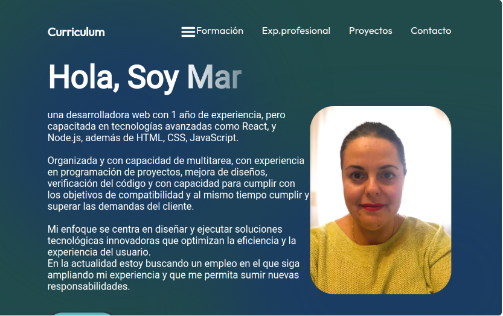
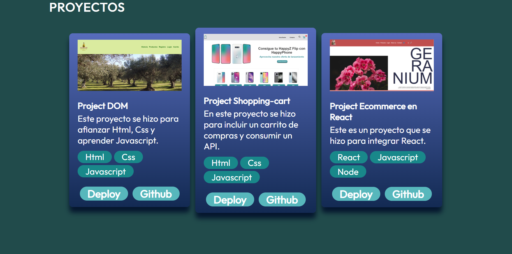

# PORTFOLIO 

Ejercicio para practicar React, haciendo nuestro Portfolio.  

Podemos navegar por la singlepage, haciendo scroll y podemos clickear en cada campo de la barra de navegación para que nos lleve al desarrollo del campo.
 

## Tabla de Contenidos

- [Instalación](#instalación)
- [Uso](#uso)
- [Contribución](#contribución)
- [Licencia](#licencia)

## Instalacion
No se permite la clonacion o duplicidad del porfolio. 

Tambien se puede ver desde <a href="https://portfolio-aspw76el4-mar-prietos-projects.vercel.app/">vercel.</a> 

## Uso

El contenido (datos/fotogradias/ informacion) incluido en este portfolio son propiedad de Mª del Mar Prieto. Todo el contenido proporcionado en este sitio es solo con fines informativos y personales. La información presentada aquí puede no ser precisa, completa o actualizada.

Mª del Mar Prieto no se hace responsable de los errores u omisiones en la información proporcionada en este sitio ni de las consecuencias derivadas de la utilización de dicha información.

No se permite la reproducción, distribución o modificación del contenido sin el permiso expreso por escrito de Mª del Mar Prieto.

Enlaces a sitios web externos se proporcionan únicamente como una conveniencia para el usuario. Mª del Mar Prieto no respalda ni garantiza la exactitud ni la idoneidad de la información proporcionada por esos sitios.

Mª del Mar Prieto se reserva el derecho de modificar, agregar o eliminar cualquier parte de este sitio web o de estas condiciones en cualquier momento y sin previo aviso.

Al utilizar este sitio web, usted acepta los términos y condiciones aquí establecidos.
De acuerdo a las leyes:

*. Ley Orgánica de Protección de Datos Personales y garantía de los derechos digitales (LOPDGDD).

*. Ley de Propiedad Intelectual (LPI): Esta ley protege los derechos de autor y la propiedad intelectual. Es relevante si compartes contenido original, como código fuente, diseño, texto o imágenes.

*. Reglamento General de Protección de Datos (RGPD): Aunque el RGPD es una regulación de la Unión Europea, es aplicable en España y establece normas específicas para la protección de datos personales.

## Desarrolladores:

> <a href="https://www.linkedin.com/in/mar-prieto-garcia/">- María del Mar Prieto Garcia</a>

## Tecnologías utilizadas

- HTML
- CSS
- JavaScript
- Json
- REACT 

## React + Vite

This template provides a minimal setup to get React working in Vite with HMR and some ESLint rules.

Currently, two official plugins are available:

- [@vitejs/plugin-react](https://github.com/vitejs/vite-plugin-react/blob/main/packages/plugin-react/README.md) uses [Babel](https://babeljs.io/) for Fast Refresh
- [@vitejs/plugin-react-swc](https://github.com/vitejs/vite-plugin-react-swc) uses [SWC](https://swc.rs/) for Fast Refresh

## Licencia

Este proyecto está bajo la Licencia [CCO](LICENSE).